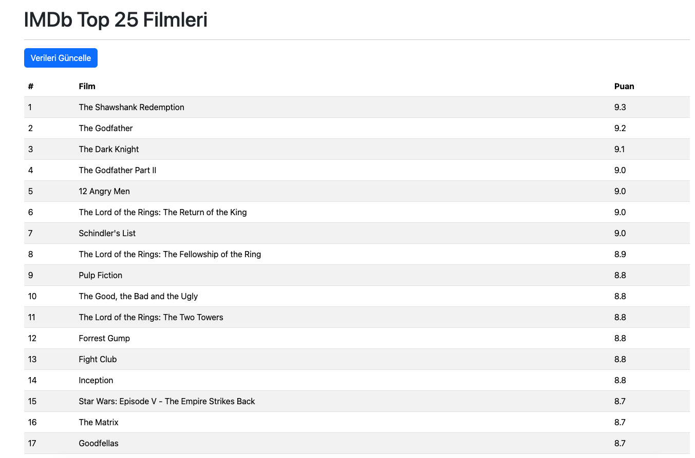

# Seçilen Proje:

D19: Web Kazıma Veri Modeli

- Konu: Scraping, ORM ve web listeleme entegrasyonu.
- Bileşenler: Flask, Flask-SQLAlchemy, requests, BeautifulSoup.
- Gereksinimler:
    * Film modeli (ad, puan) tanımlama.
    * Harici bir film listeleme sitesinden veri çekme.
    * Çekilen verileri Film modeline kaydetme.
    * Flask arayüzünde filmleri puana göre sıralanmış olarak listeleme.

# Yapılanlar:

- movies.db adında dosya oluşturulur.
- movie adında bir tablo oluşturulur.
- Tablo Kolonları: id (int, pk), title (String, not null, unique), rating (float)
- Film bilgileri https://www.imdb.com/chart/top/ adresinden requests kütüphanesi ile kazınır.
- Kazıma işlemi, index sayfasında bir butona basılarak yapılır.
- Film adı, rate, film url bilgisi beautifulsoup ile çekilir ve movie tablosuna kaydedilir.
- Her veri çekme işinde listede olmayan filmler silinir ve yeni liste oluşturulur.
- Liste film rate değerine göre büyükten küçüğe doğru sıralanır.

- Filmin ismine tıklandığında https://www.imdb.com sitesindeki detay sayfası açılır.
